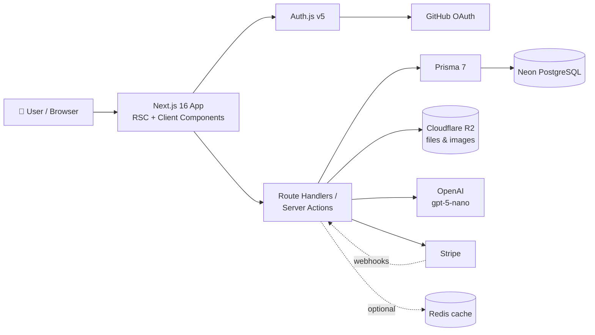
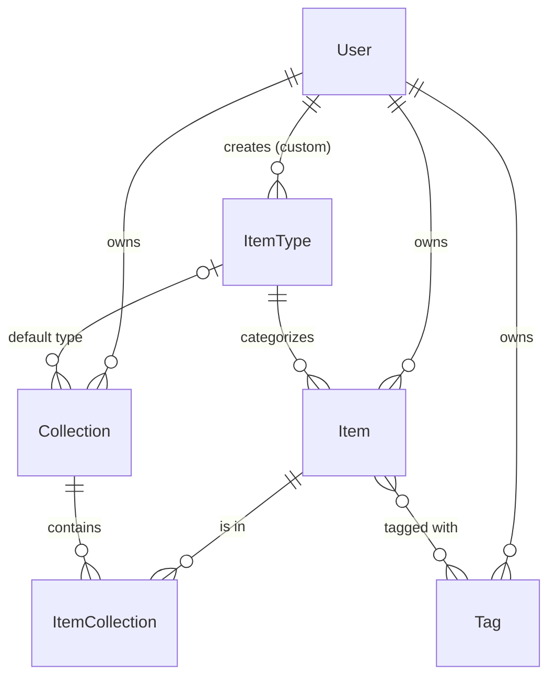

# 🗃️ DevStash — Project Overview

> **One fast, searchable, AI-enhanced hub for all your dev knowledge and resources.**

---

## 📌 Problem

Developers keep their essentials scattered:

| What                 | Where it usually lives    |
| -------------------- | ------------------------- |
| Code snippets        | VS Code, Notion           |
| AI prompts           | Buried in chat histories  |
| Context files        | Deep inside projects      |
| Useful links         | Browser bookmarks         |
| Docs                 | Random folders            |
| Commands             | `.txt` files              |
| Project templates    | GitHub Gists              |
| Terminal commands    | Bash history              |

The result is context switching, lost knowledge and inconsistent workflows. **DevStash** brings all of it into one place.

---

## 👥 Target Users

| Persona                         | Primary need                                           |
| ------------------------------- | ------------------------------------------------------ |
| 🧑‍💻 **Everyday Developer**       | Quickly grab snippets, prompts, commands, links        |
| 🤖 **AI-first Developer**        | Save prompts, contexts, workflows, system messages     |
| 🎓 **Content Creator / Educator** | Store code blocks, explanations, course notes          |
| 🏗️ **Full-stack Builder**        | Collect patterns, boilerplates, API examples           |

---

## ✨ Features

### A. Items & Item Types

Every item has a **type**. DevStash ships with fixed **system types**; users will be able to create **custom types** later (Pro).

| Type    | Content kind | Color                                                       | Icon ([Lucide](https://lucide.dev/icons/)) | Plan |
| ------- | ------------ | ----------------------------------------------------------- | ------------------------------------------ | ---- |
| Snippet | Text         |  `#3b82f6` blue    | [`Code`](https://lucide.dev/icons/code)              | Free |
| Prompt  | Text         |  `#8b5cf6` purple  | [`Sparkles`](https://lucide.dev/icons/sparkles)      | Free |
| Command | Text         |  `#f97316` orange  | [`Terminal`](https://lucide.dev/icons/terminal)      | Free |
| Note    | Text         |  `#fde047` yellow  | [`StickyNote`](https://lucide.dev/icons/sticky-note) | Free |
| Link    | URL          |  `#10b981` emerald | [`Link`](https://lucide.dev/icons/link)              | Free |
| File    | File         |  `#6b7280` gray    | [`File`](https://lucide.dev/icons/file)              | Pro  |
| Image   | File         |  `#ec4899` pink    | [`Image`](https://lucide.dev/icons/image)            | Pro  |

- System types **cannot be edited or deleted**.
- Each type has its own route, e.g. `/items/snippets`, `/items/prompts`.
- Items open and are created in a **drawer**, so they're quick to reach from anywhere.

### B. Collections

- A collection can hold items of **any type**.
- An item can belong to **multiple collections** (many-to-many). For example, a React snippet can be in both "React Patterns" and "Interview Prep".
- You can see which collections an item belongs to and add it to or remove it from several at once.

Examples:

- **React Patterns** (snippets, notes)
- **Context Files** (files)
- **Python Snippets** (snippets)

### C. Search

Search across **content**, **titles**, **tags** and **types**.

### D. Authentication

- Email and password
- GitHub OAuth

### E. Other Features

- ⭐ Favorite collections and items
- 📌 Pin items to the top
- 🕒 Recently used items
- 📥 Import code from a file
- 📝 Markdown editor for text types
- 📤 File upload for file types (file, image)
- 📦 Export data in several formats
- 🌙 Dark mode by default (light mode optional)

### F. AI Features (Pro)

- 🏷️ Auto-tag suggestions
- 📄 Summaries
- 🧠 "Explain this code"
- ✍️ Prompt optimizer

---

## 🧱 Tech Stack

| Layer          | Choice                                                                                          | Notes                                                             |
| -------------- | ----------------------------------------------------------------------------------------------- | ----------------------------------------------------------------- |
| Framework      | [Next.js 16](https://nextjs.org/docs) / [React 19](https://react.dev)                            | App Router, SSR pages with client components where needed         |
| Language       | [TypeScript](https://www.typescriptlang.org/docs/)                                               | Strict mode                                                       |
| Backend        | Next.js Route Handlers and Server Actions                                                       | Items CRUD, file uploads, AI calls. One repo, no separate API      |
| Database       | [Neon](https://neon.tech/docs) (serverless PostgreSQL)                                           | Hosted Postgres                                                   |
| ORM            | [Prisma 7](https://www.prisma.io/docs)                                                           | Check the latest docs; v7 changed config and client generation    |
| Caching        | [Redis](https://redis.io/docs/) *(maybe)*                                                        | Only if needed                                                    |
| File storage   | [Cloudflare R2](https://developers.cloudflare.com/r2/)                                           | S3-compatible, used for file and image items                      |
| Auth           | [Auth.js / NextAuth v5](https://authjs.dev)                                                      | Credentials and GitHub providers, Prisma adapter                  |
| AI             | [OpenAI](https://platform.openai.com/docs) `gpt-5-nano`                                          | Pro features only                                                 |
| Styling        | [Tailwind CSS v4](https://tailwindcss.com/docs) + [shadcn/ui](https://ui.shadcn.com)             | Lucide icons come bundled with shadcn                             |
| Payments       | [Stripe](https://docs.stripe.com)                                                                | Subscriptions for Pro                                             |

> [!IMPORTANT]
> **Never use `prisma db push` or change the database structure directly.** Every schema change goes through a migration (`prisma migrate dev`), which runs in development first and then in production (`prisma migrate deploy`).

### Architecture



---

## 🗄️ Data Model

> [!NOTE]
> **Rough draft.** This is a starting point, not a final schema. Expect it to change as features get built. Check the Prisma 7 docs before using it: in v7 the connection URL lives in `prisma.config.ts` and the generator syntax differs from older versions.

### Entity relationships



### Prisma schema (draft)

```prisma
// ⚠️ ROUGH DRAFT. Not final. Verify against the Prisma 7 docs before use.

generator client {
  provider = "prisma-client"
  output   = "../src/generated/prisma"
}

datasource db {
  provider = "postgresql"
  // Prisma 7: the connection URL is configured in prisma.config.ts
}

enum ContentType {
  TEXT // snippet, prompt, note, command
  URL  // link
  FILE // file, image
}

// ─── Auth.js (NextAuth v5) models ─────────────────────────────

model User {
  id            String    @id @default(cuid())
  name          String?
  email         String?   @unique
  emailVerified DateTime?
  image         String?
  password      String?   // hashed; null for OAuth-only users

  // Billing
  isPro                Boolean @default(false)
  stripeCustomerId     String? @unique
  stripeSubscriptionId String? @unique

  accounts    Account[]
  sessions    Session[]
  items       Item[]
  collections Collection[]
  itemTypes   ItemType[]
  tags        Tag[]

  createdAt DateTime @default(now())
  updatedAt DateTime @updatedAt
}

model Account {
  id                String  @id @default(cuid())
  userId            String
  type              String
  provider          String
  providerAccountId String
  refresh_token     String? @db.Text
  access_token      String? @db.Text
  expires_at        Int?
  token_type        String?
  scope             String?
  id_token          String? @db.Text
  session_state     String?

  user User @relation(fields: [userId], references: [id], onDelete: Cascade)

  @@unique([provider, providerAccountId])
}

model Session {
  id           String   @id @default(cuid())
  sessionToken String   @unique
  userId       String
  expires      DateTime

  user User @relation(fields: [userId], references: [id], onDelete: Cascade)
}

model VerificationToken {
  identifier String
  token      String   @unique
  expires    DateTime

  @@unique([identifier, token])
}

// ─── App models ──────────────────────────────────────────────

model ItemType {
  id       String  @id @default(cuid())
  name     String  // "Snippet"
  slug     String  // "snippets", used in /items/[slug]
  icon     String  // Lucide icon name, e.g. "Code"
  color    String  // hex, e.g. "#3b82f6"
  isSystem Boolean @default(false)

  userId String? // null for system types
  user   User?   @relation(fields: [userId], references: [id], onDelete: Cascade)

  items              Item[]
  defaultCollections Collection[]

  @@unique([userId, slug])
}

model Item {
  id          String      @id @default(cuid())
  title       String
  description String?
  contentType ContentType

  content  String? @db.Text // text types; null for files
  url      String?          // link type
  fileUrl  String?          // R2 URL; null for text
  fileName String?          // original filename
  fileSize Int?             // bytes
  language String?          // optional, for syntax highlighting

  isFavorite Boolean   @default(false)
  isPinned   Boolean   @default(false)
  lastUsedAt DateTime? // powers "Recently used"

  userId String
  user   User   @relation(fields: [userId], references: [id], onDelete: Cascade)

  itemTypeId String
  itemType   ItemType @relation(fields: [itemTypeId], references: [id])

  collections ItemCollection[]
  tags        Tag[]

  createdAt DateTime @default(now())
  updatedAt DateTime @updatedAt

  @@index([userId, itemTypeId])
  @@index([userId, lastUsedAt])
}

model Collection {
  id          String  @id @default(cuid())
  name        String
  description String?
  isFavorite  Boolean @default(false)

  // Type used for display when the collection has no items yet
  defaultTypeId String?
  defaultType   ItemType? @relation(fields: [defaultTypeId], references: [id])

  userId String
  user   User   @relation(fields: [userId], references: [id], onDelete: Cascade)

  items ItemCollection[]

  createdAt DateTime @default(now())
  updatedAt DateTime @updatedAt

  @@index([userId])
}

model ItemCollection {
  itemId       String
  collectionId String
  addedAt      DateTime @default(now())

  item       Item       @relation(fields: [itemId], references: [id], onDelete: Cascade)
  collection Collection @relation(fields: [collectionId], references: [id], onDelete: Cascade)

  @@id([itemId, collectionId])
}

model Tag {
  id   String @id @default(cuid())
  name String

  userId String
  user   User   @relation(fields: [userId], references: [id], onDelete: Cascade)

  items Item[] // implicit many-to-many

  @@unique([userId, name])
}
```

#### Changes from the original notes

- **`ContentType` enum** now has three values, `TEXT | URL | FILE`. The notes only listed `text | file`, but links are a URL type.
- **`ItemType.slug`** was added so routes like `/items/snippets` can look up the type.
- **`Item.lastUsedAt`** was added to support the "Recently used" feature.
- **`Tag` is per-user** (`userId` plus a unique name per user), so one user's tags don't show up for another.
- **Auth.js models** (`Account`, `Session`, `VerificationToken`) and a nullable `password` field were added for email/password sign-in.

---

## 💰 Monetization

Freemium model:

| Feature                       | Free                   | Pro ($8/mo or $72/yr) |
| ----------------------------- | ---------------------- | --------------------- |
| Items                         | 50 total               | Unlimited             |
| Collections                   | 3                      | Unlimited             |
| System types                  | All except file/image  | All                   |
| File & image uploads          | ❌                     | ✅                    |
| Custom types                  | ❌                     | ✅ *(coming later)*   |
| Search                        | Basic                  | Basic                 |
| AI auto-tagging               | ❌                     | ✅                    |
| AI code explanation           | ❌                     | ✅                    |
| AI prompt optimizer           | ❌                     | ✅                    |
| Export (JSON / ZIP)           | ❌                     | ✅                    |
| Priority support              | ❌                     | ✅                    |

> [!NOTE]
> **During development, every user gets every feature.** Build the Pro plumbing now (the `isPro` flag, Stripe fields, central limit checks), but don't enforce it yet.

---

## 🎨 UI / UX

### Design principles

- Modern, minimal and built for developers
- Dark mode by default, light mode optional
- Clean typography and generous whitespace
- Subtle borders and shadows
- Syntax highlighting in code blocks
- Inspiration: [Notion](https://notion.so), [Linear](https://linear.app), [Raycast](https://raycast.com)

### Layout

```
┌──────────────┬───────────────────────────────────────────────┐
│  DevStash    │  🔍 Search…                          [+ New]  │
│              ├───────────────────────────────────────────────┤
│  TYPES       │  Collections                                  │
│  </> Snippets│  ┌──────────┐ ┌──────────┐ ┌──────────┐       │
│  ✨ Prompts  │  │ React    │ │ Context  │ │ Python   │       │
│  >_ Commands │  │ Patterns │ │ Files    │ │ Snippets │       │
│  🗒 Notes    │  └──────────┘ └──────────┘ └──────────┘       │
│  📄 Files    │   (card background = dominant item type)      │
│  🖼 Images   │                                               │
│  🔗 Links    │  Items                                        │
│              │  ┌──────────┐ ┌──────────┐ ┌──────────┐       │
│  COLLECTIONS │  │ useDebou…│ │ git undo │ │ Sys prom…│       │
│  React Patt… │  └──────────┘ └──────────┘ └──────────┘       │
│  Python Sni… │   (card border = item type color)             │
└──────────────┴───────────────────────────────────────────────┘
                                         item opens in a drawer ──▶
```

- **Sidebar** (collapsible): item types linking to their item lists, plus the latest collections.
- **Main area:** a grid of collection cards. Each card's **background color** matches the type that makes up most of its items. Items appear below in cards whose **border color** matches their type.
- **Item detail:** opens in a **drawer** for quick viewing and editing.

### Responsive

- Desktop first, but usable on mobile.
- On mobile the sidebar becomes a drawer.

### Micro-interactions

- Smooth transitions
- Hover states on cards
- Toast notifications for actions
- Loading skeletons

---

## ❓ Open Questions

- **Search:** does "basic search" (Free) differ from search on Pro, or is that row the same for both? If they differ, decide what Pro adds (e.g. full-text or semantic search with Postgres `tsvector` or `pgvector`).
- **Export formats:** the features list says "different formats", while the Pro plan says JSON/ZIP. Settle on the exact list.
- **AI Summaries:** listed under AI features but missing from the Pro plan table.
- **Downgrades:** what happens to a user's items and files when they drop from Pro to Free while over the limits?
- **Redis:** is it actually needed at launch, or should it wait until a real bottleneck shows up?
